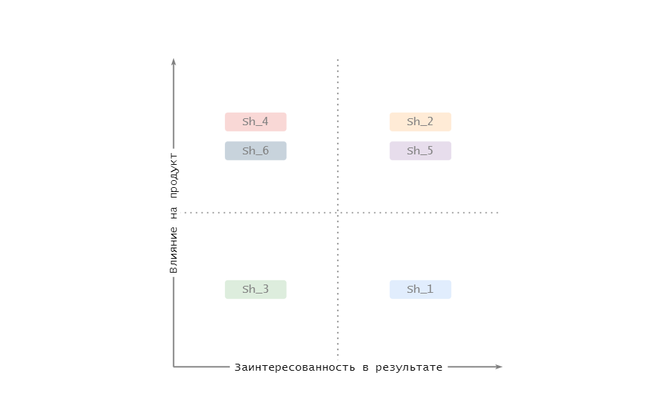

# Описание

Todo

# Содержание
- [Детализация бизнес-целей](#bn_details)
- [Анализ и список функциональных требований](#func_req)
- [Анализ стейкхолдеров и их интересов](#stakeholders)
- [Разработка концептуальной архитектуры](#arch_concept)
- [Описание рисков реализации (бизнес и технические)](#risks)
- [План поэтапной разработки и расширения системы, анализ критически важных компонентов](#steps)
- [Выделение критических бизнес-сценариев](#business_critical)
- [Атрибуты качества](#qa)
- [Анализ и список нефункциональных требований](#nfr)
- [Анализ и описание архитектурных опций и обоснование выбора](#arch_option)
- [Список ADR](#adrs)
- [Описание сценариев использования приложения](#use_cases)
- [Базовая архитектура с учётом ограничений бизнес-требований, НФТ, выбранной архитектуры, адресация атрибутов качества](#basic_arch)
- [Основные представления](#views)
    - [Функциональное](#funk_views)
    - [Информационное](#info_views)
    - [Многозадачность](#concurency_views)
    - [Инфраструктурное](#infra_views)
    - [Безопасность](#security_views)
- [Анализ рисков созданной архитектуры, компромиссов](#compromises)
- [Стоимость владения системой в первый, второй и пятый годы с учётом роста данных и базы пользователей](#cost)

## Детализация бизнес-целей 
Бизнес-цели приложения:
* Увеличение продаж товаров бренда за счет формирования позитивного отношения к бренду
* Сокращение накладных расходов на рекламу и продвижение бренда, формировние эффекта "сарафанного радио", за счет увеличения проникновения в социальные группы 
спортсменов/тренеров/спортивных клубов/и пр.
* Повышение лояльности к бренду который продвигает в обществе здоровый образ жизни 
* Увеличение кросс-продаж с помощью механизма рекомендаций на основе профиля пользователя + охват "не спортсменов" (скидки/бонусы/реферальные программы) 

## Анализ и список функциональных требований 

Пользователь, здесь и далее - зарегистрированный в приложении человек с ником и id в системе
* **Fr_1:** Приложение должно позволять зарегистрироваться в системе (создать профиль) указав
    * свое имя
    * пол
    * возраст
    * интересующий вид спорта
    * место проживания (город/район)
* **Fr_2:** Приложение должно позволять пользователям осуществлять покупки от своего лица (учетной записи)
    * онлайн (сайт/мобильное приложение)
    * офлайн (магазины бренда/реселлеры/пункты выдачи)
* **Fr_3:** Приложение должно позволять пользователю отслеживать информацию о своих тренировках
    * дата последней тренировки
    * длительность тренировок по дням
    * предположительные результаты тренировок (пройденное расстояние/велотренировка/количество сожженных калорий)
    * предположительный износ инвентаря/одежды бренда (обувь/одежда (сезонность)/расходные материалы )
* **Fr_4:** Приложение должно давать возможность пользователю делиться своими интересами и вступать в различные сообщества (по видам спорта)
* **Fr_5:** Приложение должно позволять делиться своими достижениями среди других пользователей приложения (скрывая детали своего профиля)

## Анализ стейкхолдеров и их интересов 

Список стейкхолдеров:
* **Sh_1:** Пользователи:
    * поддержание интереса к здоровому образу жизни
    * получение выгодных предложений от бренда 
    * расширение границ тренировок (географических) и типов тренировок (новые/смежные виды спорта)
    * новые знакомства (тренировки в группах/соревнования/поездки в соседние регионы)
    * вырабатывание полезных привычек (управление мотивацией)
* **Sh_2:** Владельцы продукта (PO):
    * формирование узнаваемости бренда (+ goodwill)
    * продвижение товаров бренда в фокусных группах + расширение таких групп
    * сокращение расходов на рекламу и продвижение бренда
    * увеличение продаж всех ниш товара бренда
    * поиск коллабораций с производителями не конкурентами (iOt, производители мобильных устройств, социальные сети)
* **Sh_3:** Профессиональные спортивные сообщества (частные тренеры):
    * продвижение своих площадок для тренировок пользователей
    * дополнительный канал продвижения сообщества
    * увеличение продажи услуг/информации
* **Sh_4:** Служба поддержки клиентов бренда:
    * заблаговременное информирование пользователя о необходимости обновить инвентарь/одежду
    * дополнительный канал публикации особенностей товара/инструкций/лучших практик
    * дополнительный канал связи с пользователем
* **Sh_5:** Разработчики:
    * использование передовых инженерных практик и легкость разработки
* **Sh_6:** Администраторы (DEVops):
    * простота разворачивания приложения в средах (dev/test/prod)
    * наблюдаемость и настраиваемость системы 

### Матрица стейкхолдеров:

## Разработка концептуальной архитектуры 
--

## Описание рисков реализации (бизнес и технические) 
--

## План поэтапной разработки и расширения системы, анализ критически важных компонентов 
--

## Выделение критических бизнес-сценариев 
--

## Атрибуты качества 
--

## Анализ и список нефункциональных требований 
--

## Анализ и описание архитектурных опций и обоснование выбора 
--

## Список ADR 
--

## Описание сценариев использования приложения 
--

## Базовая архитектура с учётом ограничений бизнес-требований, НФТ, выбранной архитектуры, адресация атрибутов качества 
--

## Основные представления 
--

### Функциональное 
--
### Информационное 
--
### Многозадачность 
--
### Инфраструктурное 
--
### Безопасность 
--

## Анализ рисков созданной архитектуры, компромиссов 
--

## Стоимость владения системой в первый, второй и пятый годы с учётом роста данных и базы пользователей 