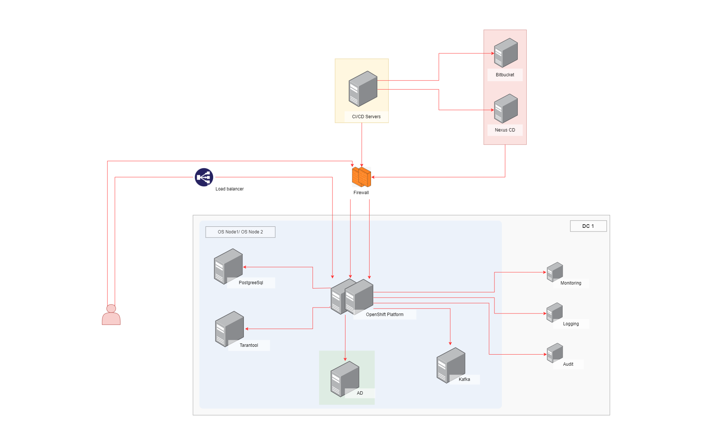

# Описание
Приложение направлено на популяризацию здорового образа жизни и поддержание высокой мотивации пользователей на занятие спортом с использованием товаров бренда.
Приложение отслеживает прогресс тренировок пользователей, позволяет им соревноваться в игровой форме, знакомится с новыми видами спорта, тренировками и людьми.
А так же реализует механики персональных рекомендаций для каждого пользователя по улучшению показателей тренировок, а как следствие поддержания высокого качества жизни.

# Содержание
- [Детализация бизнес-целей](#bn_details)
- [Анализ и список функциональных требований](#func_req)
- [Анализ стейкхолдеров и их интересов](#stakeholders)
- [Разработка концептуальной архитектуры](#arch_concept)
- [Описание рисков реализации (бизнес и технические)](#risks)
- [План поэтапной разработки и расширения системы, анализ критически важных компонентов](#steps)
- [Выделение критических бизнес-сценариев](#business_critical)
- [Атрибуты качества](#qa)
- [Анализ и список нефункциональных требований](#nfr)
- [Анализ и описание архитектурных опций и обоснование выбора](#arch_option)
- [Список ADR](#adrs)
- [Описание сценариев использования приложения](#use_cases)
- [Базовая архитектура с учётом ограничений бизнес-требований, НФТ, выбранной архитектуры, адресация атрибутов качества](#basic_arch)
- [Основные представления](#views)
    - [Функциональное](#funk_views)
    - [Информационное](#info_views)
    - [Многозадачность](#concurency_views)
    - [Инфраструктурное](#infra_views)
    - [Безопасность](#security_views)
- [Анализ рисков созданной архитектуры, компромиссов](#compromises)
- [Стоимость владения системой в первый, второй и пятый годы с учётом роста данных и базы пользователей](#cost)

## Детализация бизнес-целей 
Бизнес-цели приложения:
* Увеличение продаж товаров бренда за счет формирования позитивного отношения к бренду
* Сокращение накладных расходов на рекламу и продвижение бренда, формировние эффекта "сарафанного радио", за счет увеличения проникновения в социальные группы 
спортсменов/тренеров/спортивных клубов/и пр.
* Повышение лояльности к бренду который продвигает в обществе здоровый образ жизни 
* Увеличение кросс-продаж с помощью механизма рекомендаций на основе профиля пользователя + охват "не спортсменов" (скидки/бонусы/реферальные программы) 

## Анализ и список функциональных требований 

Пользователь, здесь и далее - зарегистрированный в приложении человек с ником и id в системе
* **Fr_01:** Приложение должно позволять зарегистрироваться в системе (создать профиль) указав
    * свое имя
    * пол
    * возраст
    * интересующий вид спорта
    * место проживания (город/район)
* **Fr_02:** Приложение должно позволять пользователям осуществлять покупки от своего лица (учетной записи)
    * онлайн (сайт/мобильное приложение)
    * офлайн (магазины бренда/реселлеры/пункты выдачи)
* **Fr_03:** Приложение должно позволять пользователю отслеживать информацию о своих тренировках
    * дата последней тренировки
    * длительность тренировок по дням
    * предположительные результаты тренировок (пройденное расстояние/велотренировка/количество сожженных калорий)
    * предположительный износ инвентаря/одежды бренда (обувь/одежда (сезонность)/расходные материалы )
* **Fr_04:** Приложение должно давать возможность пользователю делиться своими интересами и вступать в различные сообщества (по видам спорта)
* **Fr_05:** Приложение должно позволять делиться своими достижениями среди других пользователей приложения (скрывая детали своего профиля)

## Анализ стейкхолдеров и их интересов 

Список стейкхолдеров:
* **Sh_01:** Пользователи:
    * поддержание интереса к здоровому образу жизни
    * получение выгодных предложений от бренда 
    * расширение границ тренировок (географических) и типов тренировок (новые/смежные виды спорта)
    * новые знакомства (тренировки в группах/соревнования/поездки в соседние регионы)
    * вырабатывание полезных привычек (управление мотивацией)
* **Sh_02:** Владельцы продукта (PO):
    * формирование узнаваемости бренда (+ goodwill)
    * продвижение товаров бренда в фокусных группах + расширение таких групп
    * сокращение расходов на рекламу и продвижение бренда
    * увеличение продаж всех ниш товара бренда
    * поиск коллабораций с производителями не конкурентами (iOt, производители мобильных устройств, социальные сети)
* **Sh_03:** Профессиональные спортивные сообщества (частные тренеры):
    * продвижение своих площадок для тренировок пользователей
    * дополнительный канал продвижения сообщества
    * увеличение продажи услуг/информации
* **Sh_04:** Служба поддержки клиентов бренда:
    * заблаговременное информирование пользователя о необходимости обновить инвентарь/одежду
    * дополнительный канал публикации особенностей товара/инструкций/лучших практик
    * дополнительный канал связи с пользователем
* **Sh_05:** Разработчики:
    * использование передовых инженерных практик и легкость разработки
* **Sh_06:** Администраторы (DEVops):
    * простота разворачивания приложения в средах (dev/test/prod)
    * наблюдаемость и настраиваемость системы 

### Матрица стейкхолдеров:

## Разработка концептуальной архитектуры 
Концептуальная архитектура затрагивает основные бизнес-сущности проектируемого решения и их возможные взаимодействия.

## Описание рисков реализации (бизнес и технические) 
* **Br_001:** Риск привышения бюджета проекта. При последующих этапах реализации и возможном использовании сторонних (облачных)
вычислительных мощностей, вследствии недооценки количества пользователей (либо обратная ситуация)
* **Br_002:** Смещение сроков реализации функциональности при попытке одновременной реализации всех запланированных функций/фич
приложения
* **Br_003:** Низкая вовлеченность владельцев проекта либо пользователей. Слабо сформулированые бизнес цели и желаемые функции
* **Br_004:** Отсутствие либо сложность найма необходимых сотрудников (аналитики/разработчики/тестировщики)
* **Br_005:** Регуляторный риск (внешний). Изменение законодательства (например по работе с перс. данными)
* **Br_006:** Отсутствие доступности приложения для некоторых групп людей (например людей с ограниченными возможностями)
* **Br_007:** Использование социальных групп приложения не по прямому назначению (маркетинг и пр.)

* **Tr_001:** Неверно подобраны технологии реализации проекта (ЯП, ПО)
* **Tr_002:** Существующая инфраструктура (оборудование, технологии) не подходит для реализации
* **Tr_003:** Большое количество интеграций с внешними системами и зависимость от их работоспособности (либо обновлений)
* **Tr_004:** Неверно расчитано количество предполагаемых пользователелей продукта (не выдержит нагрузки)
* **Tr_005:** Возможность кражи личных и платежных данных пользователей приложения

## План поэтапной разработки и расширения системы, анализ критически важных компонентов 
* **Mt_01:** Проектирование и разработка сервиса (сервисов) управления профилем пользователя:
    * проектирование интеграций с существующими системами авторизации/профиля покупателя/личным кабинетом (корзиной)
        * разработка API/Db
        * согласование контрактов между системами (командами)
        * доработка инфраструктуры интеграций 
    * проектирование/разработка личного кабинета (пространства) пользователя приложения с базовыми функциями:
        * управление профилем/реализация сквозной сущности пользователя
        * выбор вида спорта (не более 3-4: бег, ходьба, велопрогулки, плаванье)
        * сервис расписания тренировок
    * проектирование/разработка сервиса сообщества спортсменов/любителей спорта:
        * разработка клиентских путей регистрации в сообществе
        * разработка модуля промоакций 
        * разработка CMS для сообщества 
    * разработка механизмов защиты пользовательских данных:
        * внедрение уровней авторизации и ролевых моделей
        * защита внутренних и внешних API 
        * внедрение валидации запросов и практик нулевого доверия
        * внедрение аутентификации через сторонние сервисы (Google/Apple/LinkedIn/Facebook etc.) [ADR-001: Авторизация через сторонние сервисы](adrs/ADR-001%20Авторизация%20через%20сторонние%20сервисы.md)
    * разработка релизной политики
    * проектирование CI/CD пайплайнов
* **Mt_02:** Разработка сервиса сообщество пользователей:
    * разработка сервиса пользовательских групп в сообществе
        * группировка пользователей по выбранным видам спорта и региону тренировок
        * доработка ролевой модели пользователя
        * реализация функциональности добавления друзей
    * разработка сервиса событий сообщества
        * проектирование и разработка типов событий 
        * разработка привязки событий к определенным местам (картографический сервис)
        * разработка интеграций с сервисом пользовательских групп и модулем промоакций
    * разработка хранилища результатов пользовательских тренировок:
        * доработка пользовательского профиля (скрывать/показывать свои результаты)
        * разработка механизма агрегации пользовательских результатов [ADR-002: Агрегация результатов тренировок](adrs/ADR-002%20Агрегация%20результатов%20тренировок.md)
* **Mt_03:** Разработка и интеграция служебных сервисов:
    * разработка сквозного сервиса нотификаций ползователя (mobile):
        * нотификация пользователя о событиях сообщества/групп
        * нотификация о промоакциях отдела продаж и сопровождения клиентов
        * нотификации о результатах и достижениях друзей или групп в целом
        * стимулирующие нотификации о необходимости тренировок (мотивирующие)
        * нотификации о необходимости обновления инвентаря
    * разработка интеграции и подключения различных умных устройств:
        * интеграция с API мобильных устройств (iOS, Android)
        * интеграция с сторонними приложениями (Apple Health, Google fit, Mi fit, etc.)
        * интеграция с прочими устройствами (весы, часы, браслеты, вело-навигаторы и пр.) 
        * разработка отдельного слоя хранения и передачи данных от iOt устройств
    * разработка сервиса рекомендаций для пользователя:
        * разработка и внедрение алгоритмов машинного обучения для рекомендаций тренировок (в зависимости от параметров пользователя) [ADR-003: Внедрение ML алгоритмов](adrs/ADR-003%20Внедрение%20ML%20алгоритмов.md)
        * разработка интеграций сервиса с существующими сервисами (агрегация/нотификации/профиль пользователя)
    * разработка модуля геймификации
        * проектирование интеграций
        * разработка игровых механик и алгоритмов
* **Mt_04:** Релиз и стабилизация:
    * выпуск MVP 
    * проведение A/B тестирования
    * фиксация улучшений, устранение дефектов и проработка бэклога последующих релизов
* **Mt_05:** Мультиязычность:
    * внедрение поддержки нескольких языков (английский, китайский, французкий, немецкий)

### Критически важные компоненты:
* кабинет/пространство пользователя 
* модуль сбора данных/метрик тренировок пользователя
* сквозная авторизация пользователя (информационная безопасность и защита данных)
* сервис сообществ пользователя 
* сервисы управления и хранения контента
* интеграция с устройствами пользователя (хранение и обработка данных от умных устройств)

## Выделение критических бизнес-сценариев 
* **Bc_01:** Пользователь может зарегистрироваться в приложении даже не являясь покупателем товаров бренда
* **Bc_02:** Пользователь может вступить в выбранные группы и получать информацию о событиях групп
* **Bc_03:** Система направляет пользователям уведомления о промоакциях, новинках и событиях (+ пользователь может отказаться от части уведомлений)
* **Bc_04:** Приложение легко интегрируется с устройствами iOt пользователя
* **Bc_05:** Прогресс тренировок и их расписание доступны пользователю в любое время
* **Bc_06:** Пользователь может восстановить/удалить свой профиль в сообществе
* **Bc_07:** Пользователю доступны его покупки в магазинах бренда и процент их предполагаемого износа

## Атрибуты качества 
**Общие**
* **Qa_01:** Приложение должно быть доступно 27/7(круглосуточно) /reliability, functionality
* **Qa_02:** Приложение должно легко интегрироваться с существующими приложениями и сервисами /interoperability
* **Qa_03:** Персональные данные пользователей должны передаваться в зашифрованном виде во всех каналах связи /safety, security, compliance

**Мобильное и веб приложения**
* **Qa_04:** Приложения должны поддерживать мультиязычность, предлагая пользователю язык в зависимости от заголовков браузера/ip адреса пользователя(минимальное исполнение англ/русс языки) /suitability, understandability, satisfaction
* **Qa_05:** При увеличении количества пользователей масштабирование системы возможно путем наращивания аппаратной части(CPU) /installability, changeability

**Сервис сообщество**
* **Qa_06:** Необходимо обеспечить резервное хранение накопленной информации в случае отказа одного из дисковых накопителей(объем резервного хранилища пропорционален объему основного хранилища) /recoverability, compliance
* **Qa_07:** Система должна обеспечивать постоянный мониторинг своего состояния(health check), с обязательным извещением по электронной почте группы NOC, в случае сбоев и подозрительной активности. /stability, analyzability
* **Qa_08:** При невозможности использования стороннего картографического сервиса должна быть реализована возможность использования резервного сервиса./suitability, accuracy

**CMS cервиса сообщество(веб приложение)**
* **Qa_09:** Доступ к CMS поддерживается только авторизованным пользователям с группами доступа: пользователь и администратор /security, safety

## Анализ и список нефункциональных требований 
* **Nfr_01:** Масштабирование может осуществляться путем добавления экземпляра сервиса в узел(дополнительный под)
* **Nfr_02:** Осуществляется резервное копирование экземпляров базы данных сервиса не реже одного раза в сутки(ночное время)
* **Nfr_03:** При высокой нагрузке на сервис нагрузка распределяется по кластерам
* **Nfr_04:** При критичном увеличении запросов(ddos) сервис автоматически снижает скорость обработки запросов(принудительно)
* **Nfr_05:** Запросы в системе должны обрабатываться не более 500 мс
* **Nfr_06:** Добавление промоакций и событий в приложение должно происходить “бесшовно” без остановки системы
* **Nfr_06:** API системы доступно круглосуточно и способно обработать пиковую нагрузку до 2000 польз/сек
* **Nfr_07:** Приложение должно обеспечивать одновременную работу до 1000 пользователей
* **Nfr_08:** Критически важные компоненты системы (API: клиентских приложений, аутентификации и авторизации, запроса клиентских данных и результатов, событий сообщества и нотификаций) должны обрабатывать входящие запросы не более 1500 мс. 

## Анализ и описание архитектурных опций и обоснование выбора 
### Использование облачных вычеслительных мощностей
На первоначальном этапе, при неизвестном количестве пользователей, прихоже к выводу что использование стороннего сервиса не целесообразно, так как:
- может привести к увеличению стоимости обслуживания приложения
- снизит контролируемость приложения и скорость его обновления
Выбор необходимо делать после деплоя MVP и оценки трафика и конечной нагрузки (но разработку и проектироване желательно делать с учетом 12 факторной модели).

### Использование только одного способа интеграции сервисов приложения
Необходимо придерживаться принципов высокой отказоустойчивости и скорости работы сервисов (компромиссы возможны)
- для внутренних API не использовать REST
- сервисы с одним подписчиком, по возможности перевести на rpc
- критически важные события направлять через шину событий (pub/sub)
- не использовать XML протокол внутри системы

### CI/CD
Использовать контейнеризацию приложений, для оркестрации на первоначальном этапе использовать открытый инструмент (бесплатный).
Автоматизировать процесс сборки и деплоя приложения.

### SQL/NoSQL
Использование табличных и документоориентированных баз данных должно быть обусловлено контекстом сервисов доменной области:
- для пользовательского профиля SQL
- для данных о результатах тренировок пользователя NoSQL
- для событий сообщества SQL
- для промоакций key|value
- для групп пользователей SQL + хранение денормализованных данных (агрегатов)
- для расписания пользователей NoSQL

## Список ADR 

* [ADR-001](adrs/ADR-001%20Авторизация%20через%20сторонние%20сервисы.md) Авторизация через сторонние сервисы
* [ADR-002](adrs/ADR-002%20Агрегация%20результатов%20тренировок.md) Агрегация результатов тренировок
* [ADR-003](adrs/ADR-003%20Внедрение%20ML%20алгоритмов.md) Внедрение ML алгоритмов
* [ADR-004](adrs/ADR-004%20Система%20нотификаций.md) Система нотификаций

## Описание сценариев использования приложения 
**Профиль пользователя**
* **Us_001:** Как пользователь, я хочу управлять своим профилем в настройках приложения, для того чтобы иметь возможность вносить/редактировать/удалять необходимые мне пункты, а так же ограничивать их видимость другим членам сообщества
* **Us_002:** Как пользователь, я хочу отслеживать результаты своих тренировок с возможностью выбора необходимого мне периода, для того чтобы наблюдать прогресс своих тренировок
* **Us_003:** Как пользователь, я хочу получать рекомендации о подходящих тренировках и покупках на основе моих действий в приложении и результатов тренировок для того чтобы улучшить показатели тренировок
* **Us_004:** Как пользователь, я хочу составлять расписание тренировок и получать уведомления о наступлении времени начала тренировок, для того чтобы не пропускать тренировки
* **Us_005:** Как пользователь, я хочу получать уведомления о событиях в сообществе и в группах в которых я состою, для того чтобы вовремя принять решение об участии в событиях
* **Us_006:** Как пользователь, я хочу иметь возможность подключения к приложению умных устройств (часы/браслеты/навигаторы/весы), для того чтобы более точно отслеживать прогресс тренировок
* **Us_007:** Как пользователь, я хочу иметь возможность делиться результатами своих тренировок, а так же просматривать результаты других пользователей, для того чтобы получать достаточную мотивацию к тренировкам
* **Us_008:** Как пользователь, я хочу осуществлять покупки товаров бренда под одним профилем и видеть свои совершенные покупки в отдельном пространстве приложения, для того чтобы легко покупать необходимые мне товары

**Пользователь сервиса сообщество**
* **Us_009:** Как пользователь, я хочу иметь возможность вступить в определенную группу сообщества и получать новости сообщества, для того чтобы принять участие в событиях
* **Us_010:** Как пользователь, я хочу получать извещения о событиях сообщества проходящих не далеко от меня, для оперативного подключения к событию (если возможно)
* **Us_011:** Как пользователь, я хочу иметь возможность подписаться на определенных людей и группы людей которые деляться своими результатами тренировок в сообществе, для того чтобы получать мотивацию к тренировкам
* **Us_012:** Как пользователь, я хочу иметь возможность принимать участие в различных играх и акциях сообщества, для того чтобы улучшить показатели своих тренировок и/или выиграть призы (в том числе не материальные)

**Аналитик данных/служба маркетинга**
* **Us_013:** Как маркетолог, я хочу отслеживать результаты проведения маркетинговых акций, для того чтобы иметь возможность их доработки и делать вывод об их результативности
* **Us_014:** Как аналитик данных, я хочу иметь возможность ежедневного отслеживания прироста новых пользователей в приложении и увеличения продаж товаров бренда в корреляции с такими пользователями, для того чтобы выстраивать причинно-следственную связь и делать вывод об успешности приложения.
* **Us_015:** Как менеджер продукта, я хочу иметь возможность группировки пользователей по определенным параметрам, для того чтобы проводить различные виды тестирования (A/B) и принимать управленческие решения

**Контент-менеджер**
* **Us_016:** Как контент-менеджер, я хочу иметь возможность загрузки различных промо мероприятий, создания различных групп и их модерацию через удобный и понятный web-интерфейс(CMS), для того чтобы иметь возможность управления контентом в приложении
* **Us_017:** Как контент-менеджер, я хочу получать уведомления о возможном недопустимом контенте в приложении размещенном пользователями, для того чтобы блокировать/удалять такого рода контент
* **Us_018:** Как контент-менеджер, я хочу иметь возможность проведения различного рода рассылок (нотификации/письма), для сбора обратной связи от пользователей и предупреждения об обновлении различных правил

**Сотрудник службы поддержки пользователей**
* **Us_019:** Как сотрудник службы поддержки, я хочу иметь возможность по запросу пользователя однозначно его идентифицировать и проследить его действия в приложении для того чтобы оказать помощь пользователю
 
## Базовая архитектура с учётом ограничений бизнес-требований, НФТ, выбранной архитектуры, адресация атрибутов качества 

## Основные представления 

### Функциональное 

### Информационное 

### Многозадачность 

### Инфраструктурное 

### Безопасность 

## Анализ рисков созданной архитектуры, компромиссов 
### Базовые риски ###
#### Привышение бюджета и сроков проекта ####
Вероятность наступления - средняя  
Методики невелирования риска: 
- найм/хантинг специалистов (обязательно со схожим опытом) высокой квалификации до начала 0 цикла разработки проекта
- работа по гибким/инкрементальным методологиям разработки 
- закупка только простых и доступных всегда элементов инфраструктуры
- минимальное использование "прорывных" решений при разработке кода и выстраивании инфраструктуры
Компромиссы:
- поиск и подключение компании вендора для разработки (необходима дополнительная оценка)
- использование сторонних шаблонов/фреимворков для разработки приложений

## Стоимость владения системой в первый, второй и пятый годы с учётом роста данных и базы пользователей 